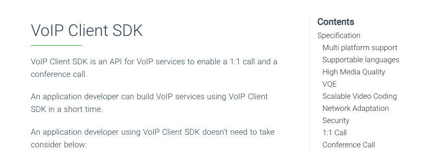

# Docsify page ToC

It's a simple [docsify](https://docsify.js.org/) plugin to print page's ToC.
It's useful when your page gets longer and whole ToC overflows the the page height.

On the desktop browser, the ToC looks like:


## How to install
Just add a built-in script to your HTML file:

```html
<script src="//unpkg.com/docsify-page-toc/dist/docsify-page-toc.js"></script>
```

## How to configure
There are 2 options you configure:
- `tocMaxLevel`: The maximum depth of the headings printed on the ToC. If you set `tocMaxLevel` to 3, I recommand you to set `subMaxLevel` to 2 avoid ToC duplication.
- `target`: The target heading printed on the ToC. It's used as an argument to query DOM with `querySelectorAll()`

Add these configuratios into your index.html:

```html
window.$docsify = {
  ...
  'page-toc': {
    tocMaxLevel: 3,
    target: 'h1, h2, h3'
  },
}
```

## Others
To support mobile browser, the ToC will automatically move to the top of the page when the display width is lower than 1300 pixels.
